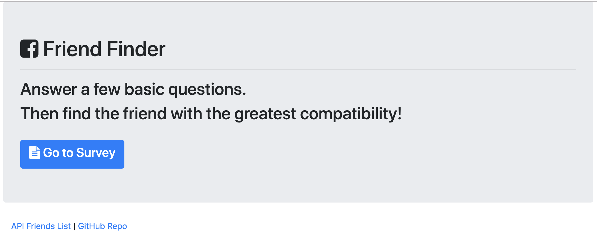

# Project Title

**Friend Finder**

## Description:

Tell us a little bit about yourself and find your best match.

### Installing

* Clone this repository
* Run npm init -y
* Run npm install

## Built With

* Javascript
* jQuery
* Node.js
* Express.js
* Bootstrap
* Chosen

The app uses the following NPM packages: 

### NPM Packages

* Express - Node.js framework

## Instructions

* Start the program by running 'node server.js' in the terminal
* Open your browser to localhost:3000
* You will be presented with the home page
* Alternately go to https://friendfinder-maz.herokuapp.com/

* Click on Go To Survey to answer questions about yourself. When finished click Submit and your perfect match will be displayed.
* At the bottom of the page are links to view all your saved Friends, the GitHub Repository, and to get back to the Home Page 

## GitHub Repo
https://github.com/lmasullo/FriendFinder

## Versioning

We use [SemVer](http://semver.org/) for versioning. 
Current version is 1.0

## Authors

**Larry Masullo (sole author)**

## Portfolio
https://www.masullodev.com

## License

This project is licensed under the MIT License - see the [LICENSE.md](LICENSE.md) file for details

## Acknowledgments

Thanks to the Instructors and Teaching Assistants in the UT Full Stack Coding Bootcamp for their support. 
